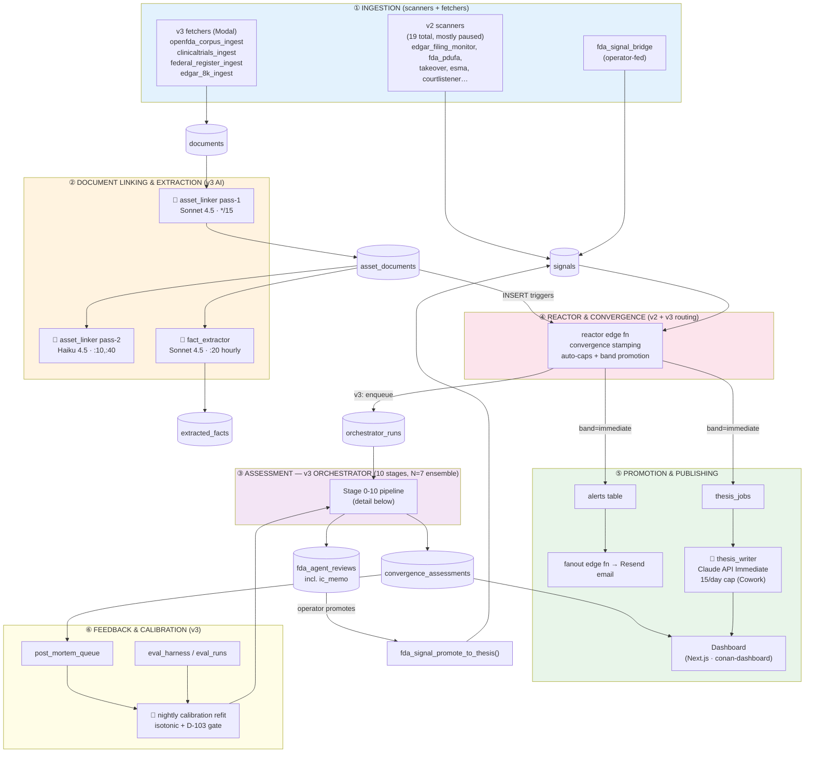
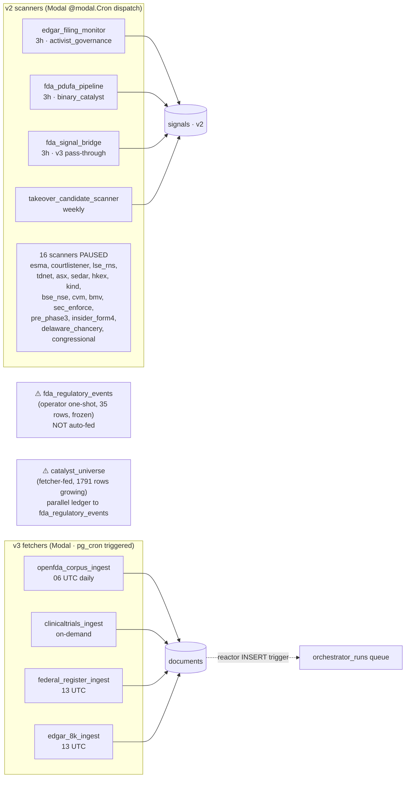
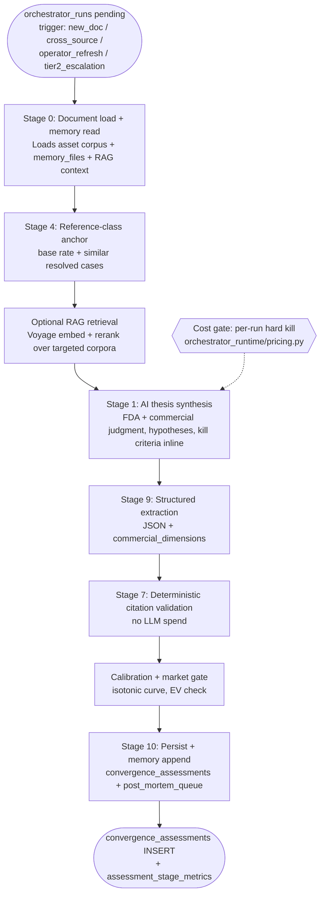
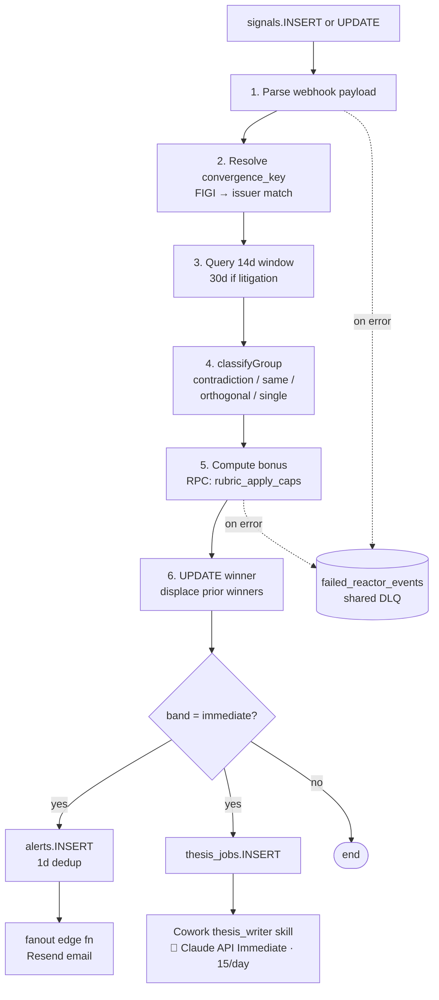
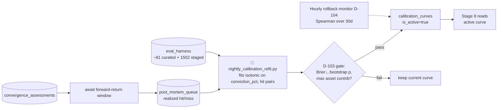
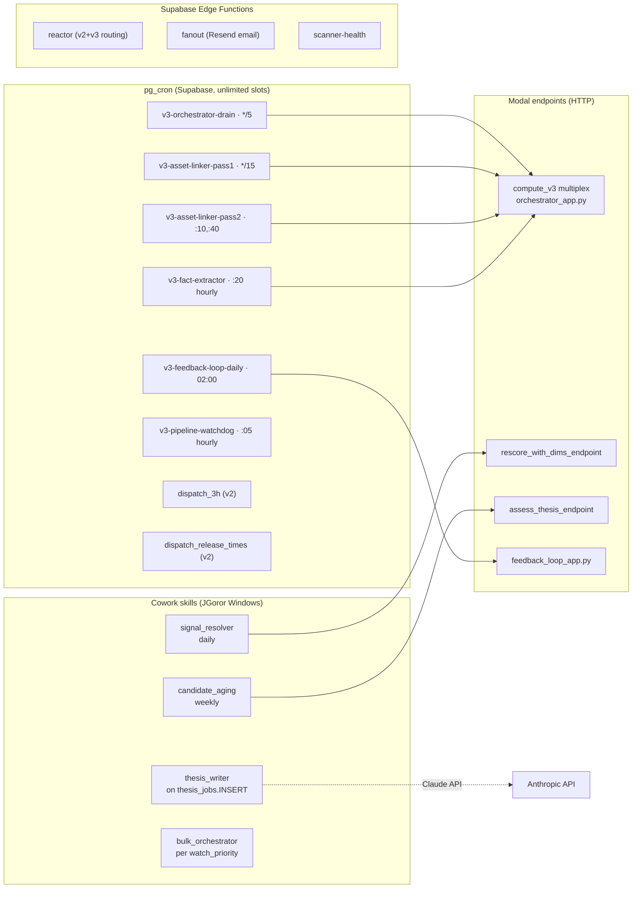

# Conan Data Flow & AI Jobs — System Diagram

**As of 2026-05-13.** Dual-pipeline state: v2 (legacy, phasing down) + v3 (FDA-focused, in-flight).

---

## 1. Top-Level: Layers & Flow

---

## 2. Ingestion Layer (Scanners + Fetchers)

---

## 3. v4 Orchestrator Pipeline — AI-First Single Pass

---

## 4. v2 Reactor Path (Legacy)

---

## 5. Feedback Loop & Calibration

---

## 6. AI Jobs — Complete Inventory

| # | Job | Trigger | Model | Compute | Cost/run |
|---|-----|---------|-------|---------|----------|
| 1 | **asset_linker pass-1** | pg_cron `*/15` | Sonnet 4.5 | Modal | $3–15 |
| 2 | **asset_linker pass-2** | pg_cron `:10,:40` | Haiku 4.5 | Modal | $2 |
| 3 | **fact_extractor** | pg_cron `:20 hourly` | Sonnet 4.5 | Modal | $30 |
| 4 | **Stage 1 RAG** | orchestrator_run_one | Voyage-3-large + rerank-2.5 | Modal | embed cost |
| 5 | **Stage 1 thesis synthesis** | orchestrator_run_one | Sonnet 4.5/4.6 | Modal | main analysis spend |
| 6 | **Stage 9 structured extraction** | post Stage 1 | Sonnet/Haiku extractor | Modal | low |
| 7 | **Stage 7 citation validation** | post Stage 9 | deterministic Python | Modal | none |
| 8 | **Stage 10 IC memo synthesis** | operator-triggered | Sonnet 4.5 | Modal | medium |
| 13 | **signal_resolver** (v2) | Cowork daily | Sonnet 4.5 (rescore_with_dims) | Cowork→Modal endpoint | shared budget |
| 14 | **candidate_aging** (v2) | Cowork weekly | Sonnet 4.5 (assess_thesis_v2) | Cowork→Modal endpoint | Tier 2 |
| 15 | **thesis_writer** | thesis_jobs.INSERT | Claude API (Immediate band) | Cowork (JGoror) | 15/day external cap |
| 12 | **nightly calibration refit** | pg_cron `02:00 UTC` | scipy.isotonic (no LLM) | Modal | compute-only |

---

## 7. Scheduled Jobs — Where They Run

---

## 8. Data Stores — Where Each Stage Reads/Writes

| Layer | Key tables | Notes |
|-------|------------|-------|
| **Ingestion** | `documents`, `signals`, `scanner_runs`, `catalyst_universe`, `fda_regulatory_events` | v2 writes signals; v3 writes documents. `catalyst_universe` ≠ `fda_regulatory_events` (parallel ledgers) |
| **Linking** | `asset_documents`, `extracted_facts`, `fda_assets` | Sonnet pass-1, Haiku pass-2 verdict |
| **Queue** | `orchestrator_runs` | Status: pending/running/completed/failed/killed_budget |
| **Assessment** | `convergence_assessments`, `assessment_stage_metrics`, `sub_agent_calls`, `fda_agent_reviews`, `memory_files` | Stage 10 IC memo lives in `fda_agent_reviews` agent_kind='ic_memo' |
| **Reactor** | `signals` (UPDATE), `alerts`, `thesis_jobs`, `failed_reactor_events` | Shared DLQ across reactor + Cowork preflight |
| **Calibration** | `post_mortem_queue`, `eval_harness`, `eval_runs`, `calibration_curves`, `reference_class_base_rates` | D-103 gate; D-104 hourly rollback |
| **v2 legacy** | `candidates`, `fda_event_features` | Phasing out per v2 teardown |

---

## 9. v2 vs v3 — Side-by-Side

| Dimension | v2 | v3 |
|-----------|----|----|
| Scope | 19 scanners, 6 profiles | FDA-only + EDGAR pairing |
| Pipeline | Flat reactor + convergence bonus | 10-stage orchestrator + N=7 ensemble + isotonic calibration |
| Conviction | Categorical bands (Immediate/Watchlist/Archive) | Probabilistic `conviction_pct` ∈ [0,100], calibrated nightly |
| Sub-agents | None | Literature, Competitive, Regulatory, Options Microstructure, IC Memo |
| Cost control | Unbudgeted | $15 Tier-1 / $1.50 Tier-2 hard kill |
| Dispatch | Modal @modal.Cron (5-slot limit) | pg_cron → compute_v3 multiplex (unlimited) |
| Sources | All scanners | documents → asset_documents → orchestrator |
| Output | signals → alerts/thesis_jobs | convergence_assessments → ic_memo → operator-promoted signals |

Both coexist; v2 teardown is phased (Phase 1 landed PR #30; Phases 2–4 deferred).

---

## Legend

- 🤖 = LLM/AI invocation
- 💰 = cost-gated step
- `(table)` = Supabase Postgres table
- `🟦 dashed arrow` = trigger/event (not data movement)
- pg_cron times are UTC
